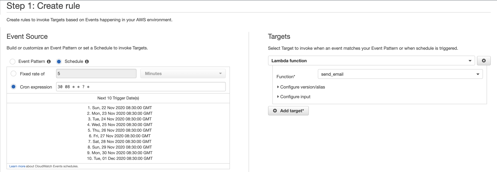
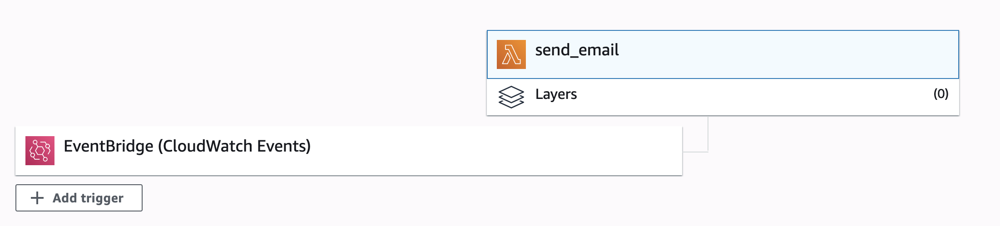

# AWS serverless email in Python

A boiler template for sending scheduled emails in AWS Lambda

## Deployment CLI

> Set up virtual environment and install packages

    virtualenv env

    source env/bin/activate

    pip install requests
    
    pip install jinja2

>   Deactivate environment

    deactivate

>   Access site packages, zip the packages and move it to the working directory

    cd env/lib/python3.8/site-packages
    
    zip -r my-deployment-package.zip .
    
    mv my-deployment-package.zip ../../../../

> Go back to the working directory and zip the application files

    cd ../../../../
    
    zip -g my-deployment-package.zip lambda_function.py template.html content.py config.py attatchments

> You can either deploy this via upload in AWS lambda or using the CLI command below. replace **Insert-lambda-name-here** with your lambda function name

    aws lambda update-function-code --function-name Insert-lambda-name-here --zip-file fileb://my-deployment-package.zip

## Set up scheduled emails

>    Go to CloudWatch > Events > Rules

> Create a Cron job to execute the lambda function. 

### Lambda setup

